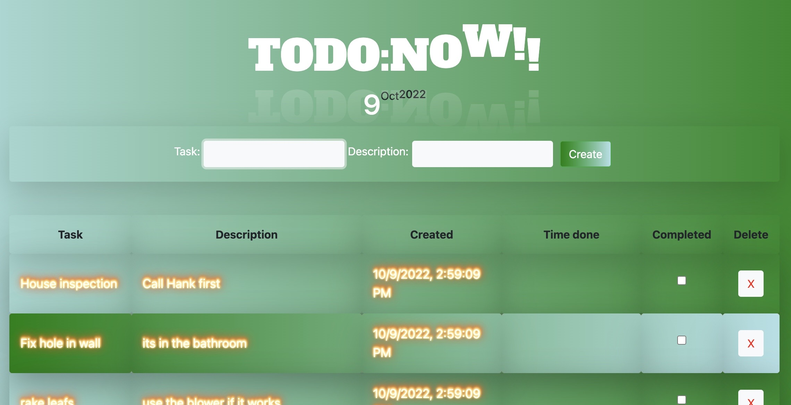
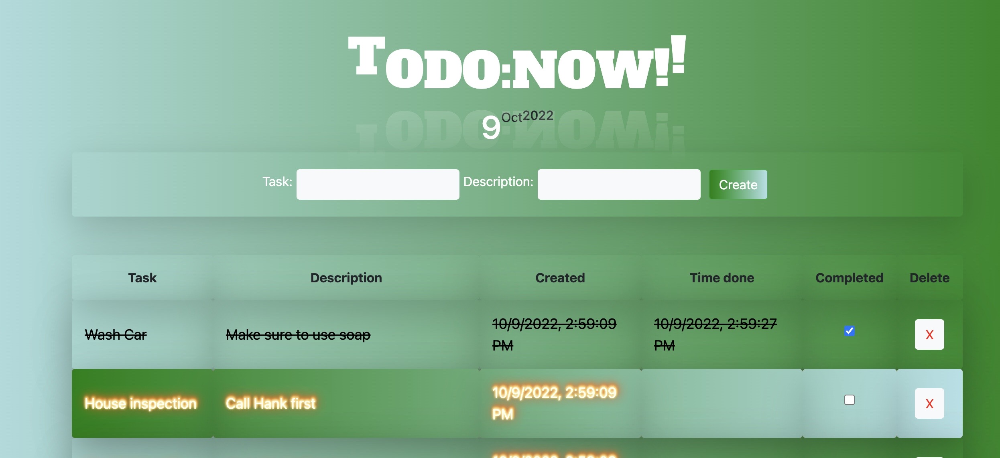

# ToDo:Now!! App

## Description

_Duration: 2 Day Sprint_

The ToDO:Now!! app helps anyone stay on top of their tasks. Simply click Create after filling out Task and Description. Tasks can be deleted by clicking the X in the task row. To extinguish a task simply click the corresponding checkbox when a task has been completed. Task will then be extinguished and a line willl go through them, aswell as be moved down towards the bottom of table with other completed tasks. Remaining non completed tasks will stay toward the top of the table where they remain on fire.

## Screen Shot

No task completed.

Some tasks completed.

### Prerequisites

Link to software that is required to develop this website.

- [javascript](https://www.javascript.com/)
- [css]
- [html]
- [jquery]
- [git](https://git-scm.com/)
- [github](https://github.com/)
- [node](https://nodejs.org/en/)
- [body-parser](https://www.npmjs.com/package/body-parser)
- [pg](https://node-postgres.com/)

## Installation

1. Go to https://github.com/tormodsletteboe/weekend-sql-to-do-list
2. Fork that repo into your own github account.
3. Copy the ssh address
4. In your terminal navigate to a folder you want to clone into.
5. Run `git clone [ssh address]` in your terminal
6. cd into the cloned folder and run `code .` in your terminal to open the project in vscode.
7. Make sure 'express', 'pg' and 'body-parser' is installed. To do so in your terminal run 'npm install'. Npm will look at your dependecies and install needed libraries. If this does not work try 'npm install express','npm install pg' and 'npm install body-parser'. 
8. To start server run 'npm start' or 'node server/server.js'
9. If it started, terminal will display 'server is up on port 5000'
10. Open a web-browser and go to 'localhost:5000'
11. You can now enjoy adding tasks and be more productive from "anywhere" in the world'.

## Usage

1. Fill out Task with a short name. Can at most be 30 characters.
2. Fill out Description. Can at most be 200 characters.
3. Click Create.
4. An uncompleted task will be added to the table, and its text will be on fire.
    -Uncompleted task will stay on fire and remain towards the top of the table.
5. After completing a task, click on the corresponding checkbox. 
    - Task text will change to black and with a line through the text.
    - The task will also be grouped towards the bottom of the table with other completed tasks.
6. To remove a task simply click X button of the corresponding task. Task is no more!!

## Built With

javascript, css, html, jquery, git and github.com

## Acknowledgement
Thanks to [Prime Digital Academy](www.primeacademy.io) who equipped and helped me to make this application a reality. (Edan Schwartz, Liz Kerber, Chris Black)

## Support
If you have suggestions or issues, please email me at [tormod.slettebo@gmail.com]

